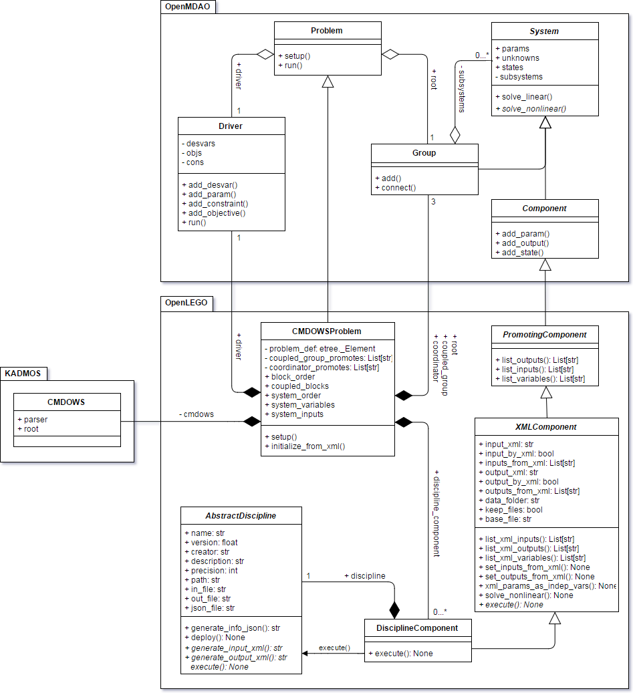

.. OpenLEGO documentation master file, created by
   sphinx-quickstart on Mon Aug 28 14:54:38 2017.
   You can adapt this file completely to your liking, but it should at least
   contain the root `toctree` directive.

Welcome to OpenLEGO's documentation!
====================================

.. toctree::
   :maxdepth: 2
   :caption: Contents:

Indices and tables
==================

* :ref:`genindex`
* :ref:`modindex`
* :ref:`search`

.. automodule:: openlego

Below the simplified class diagram of the OpenLEGO package is shown.

Example scripts for using OpenLEGO are available in the examples/scripts folder. The following scripts are available there:

* ``Wing Design``: The wing design case descirbed here was developed at TU Delft and takes a variety of different diciplines into account.

AbstractDiscipline
******************

.. automodule:: openlego.AbstractDiscipline
	:members:
	:private-members:
	:special-members:
	
BoundsNormalizedDriver
**********************

.. automodule:: openlego.BoundsNormalizedDriver
	:members:
	:private-members:
	:special-members:
	
CMDOWSProblem
*************

.. automodule:: openlego.CMDOWSProblem
	:members:
	:private-members:
	:special-members:
	
DisciplineComponent
*******************

.. automodule:: openlego.DisciplineComponent
	:members:
	:private-members:
	:special-members:
	
Recorders
*********

.. automodule:: openlego.Recorders
	:members:
	:private-members:
	:special-members:
	
util
****

.. automodule:: openlego.util
	:members:
	:private-members:
	:special-members:
	
XMLComponent
************

.. automodule:: openlego.XMLComponent
	:members:
	:private-members:
	:special-members:
	
xmlutils
********

.. automodule:: openlego.xmlutils
	:members:
	:private-members:
	:special-members: