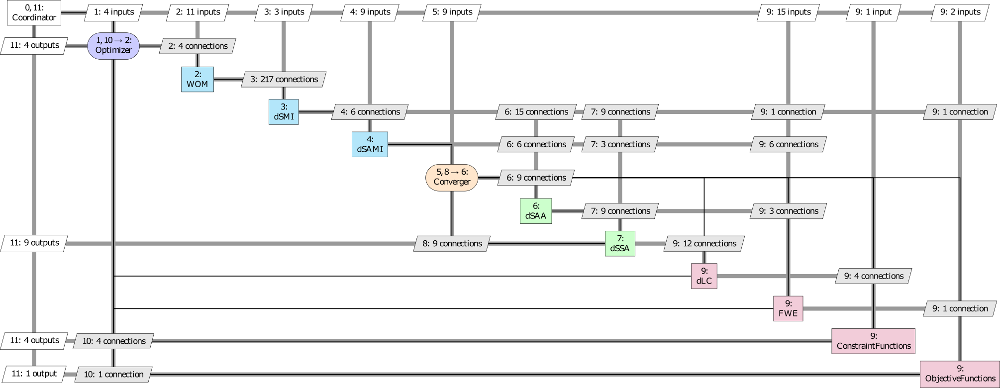

.. _`wing_opt_example`:

Wing Optimization Problem Example
=================================

   XDSM of the wing optimization problem using the MDF architecture

Important Information for this Example
**************************************

In order to be able to run the wing optimization example the Open-source `dAEDalus tool <https://github.com/sbind/dAEDalusNXT>`_
is required. *dAEDalus* is not bundled with this repo. The user should obtain it manually from Github and install it and
its dependencies.

*dAEDalus* is written for `MATLAB <https://www.mathworks.com/products/matlab.html>`_, so a working installation of it is
required as well. This example interfaces with the MATLAB code of *dAEDalus* using the
`MATLAB Engine API for Python <https://www.mathworks.com/help/matlab/matlab-engine-for-python.html>`_. The Python package
required to use this API is bundled with MATLAB, but should be installed in Python before the Python interpreter
recognizes it. Instructions for how to do this can be found at
`this link <https://www.mathworks.com/help/matlab/matlab_external/install-the-matlab-engine-for-python.html>`_.

Two other tools that *dAEDalus* needs are `TIXI <https://github.com/DLR-SC/tixi>`_ and `TIGL <https://github.com/DLR-SC/tigl>`_.
It uses these to read and write `CPACS <https://github.com/DLR-LY/CPACS>`_ files. Their installation includes bindings for
MATLAB which are required by *dAEDalus*.

Finally, once the *TIXI* and *TIGL* bindings, as well as *dAEDalus* have been obtained, a number of folders should be
ensured to be present in the MATLAB search path every time a new instance of MATLAB is started. To do so, create a file
called `startup.m` in the default working directory of MATLAB with the following contents:

.. code-block:: matlab

   addpath('/path/to/tixi/matlab')
   addpath('/path/to/tigl/matlab')
   addpath('/path/to/dAEDalus/aerodynamics')
   addpath('/path/to/dAEDalus/aircraft')
   addpath('/path/to/dAEDalus/criticaldesign')
   addpath('/path/to/dAEDalus/geometry')
   addpath('/path/to/dAEDalus/stdlib')
   addpath('/path/to/dAEDalus/structures')

Where `/path/to/...` should of course be replaced with the correct paths to *TIXI*, *TIGL*, and *dAEDalus*.
